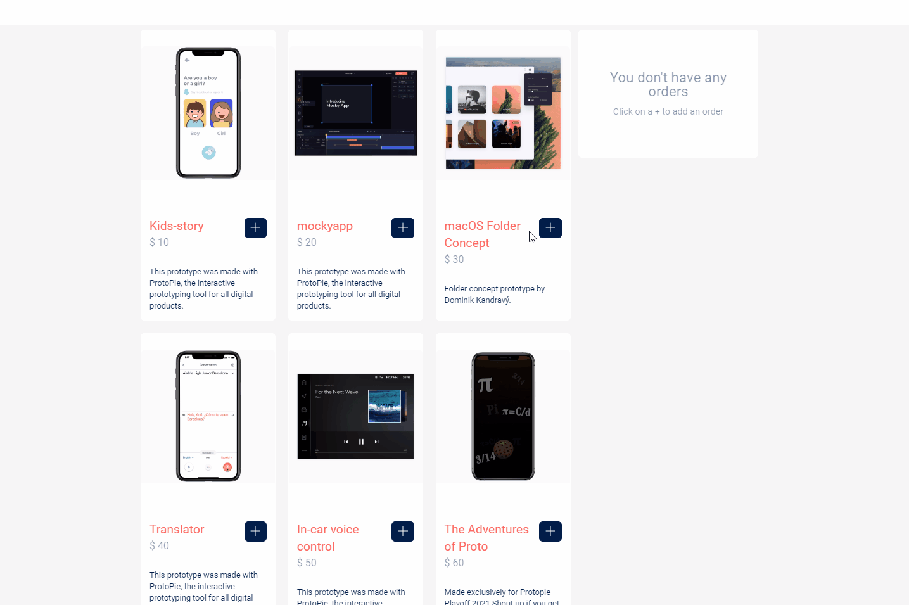

# <div style="font-size:3rem; text-align:center">Simple Shopping Catalogue</div>

React의 기본 기능을 이용하여 쇼핑 사이트 장바구니 시스템의 일부를 구현해본 데모 프로젝트

&nbsp;

# <div style="text-align:center">📚 Stacks</div>

<div style="text-align:center">


</div>

&nbsp;

# <div style="text-align:center">🏫 Features</div>

&nbsp;

## 메뉴 장바구니 추가 및 삭제

---

 

&nbsp;

# <div style="text-align:center">⚽ Installation</div>

Note: `package.json` 에 관련 dependency가 등록되어 있습니다.

&nbsp;

터미널 상에서 다음 명령어를 입력하여 연관 패키지를 설치합니다.

```
npm install
```

&nbsp;&nbsp;

# <div style="text-align:center">🖊️ Script</div>

- 터미널 상에서 아래의 스크립트로 동작합니다.

&nbsp;&nbsp;

## `npm start`

---

```
npm start
```

브라우저를 열어 프로젝트를 실행시킵니다. <br/><br/>
또는 명령어 입력 후 브라우저를 직접 열어 http://localhost:3000 주소에서 결과를 볼 수 있습니다.

&nbsp;&nbsp;

## `npm build`

---

```
npm build
```

프로젝트를 빌드합니다. <br/><br/>
빌드 후 생성된 `build` 폴더는 배포 시 해당 폴더가 배포됩니다.
